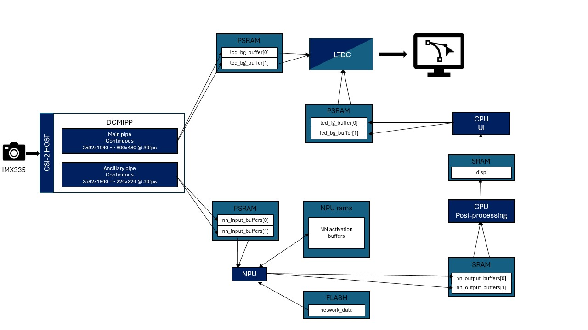
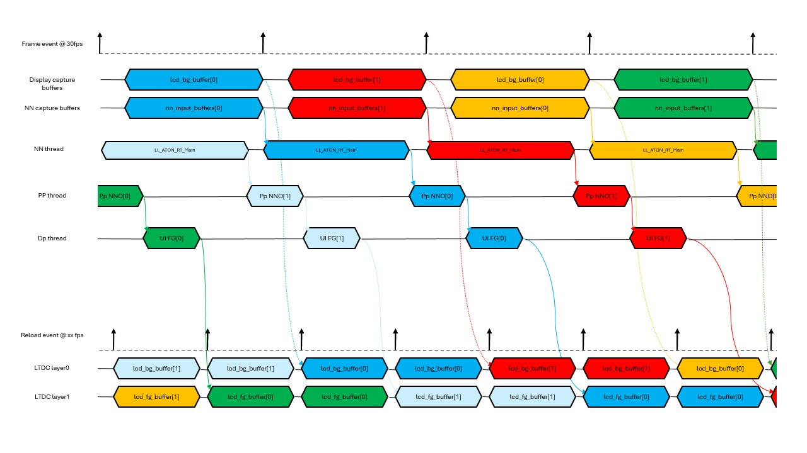
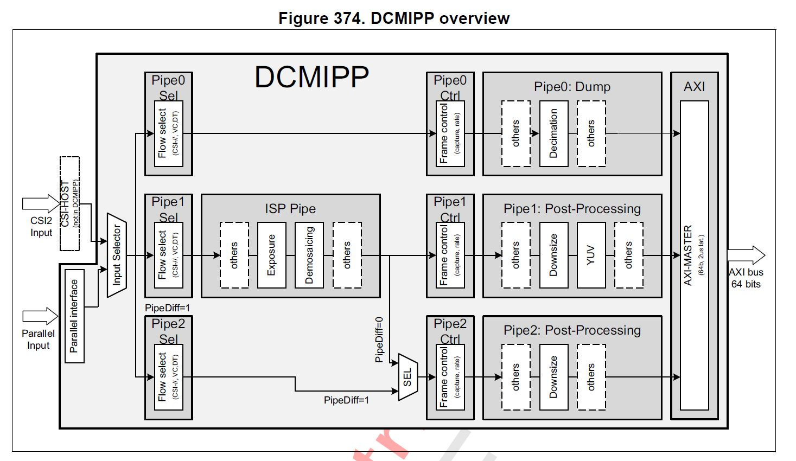

# Application Overview

### Application Data Flow

### Application Timing Diagram

## Memory Footprint Details

### Read-Only Data

| Name           | Size    | Location | Notes            |
|----------------|---------|----------|------------------|
| `network_data` | 10.59 MB | .rodata  | FLASH xSPI2 8b   |

### Read-Write Data

| Name               | Size      | Location   | Notes                             |
|--------------------|-----------|------------|-----------------------------------|
| `lcd_bg_buffer`    | 2300 KB   | .psram_bss | PSRAM / (800x480x2) x 3 / RGB565  |
| `lcd_fg_buffer`    | 1500 KB   | .psram_bss | PSRAM / (800x480x2) x 2 / ARGB4444|
| `nn_input_buffers` | 294 KB    | .psram_bss | PSRAM / (224x224x3) x 2 / RGB888  |
| `nn_output_buffers`| 12 KB     | .bss       | SRAM / 5880 x 2                   |
| `activations`      | 507 KB    | 0x34200000 | NPURAMS                           |
| `threads stacks`   | 20 KB     | .bss       | SRAM / 4096 * 5                   |

## DCMIPP and ISP

### DCMIPP Overview

- Pipe 1 is enabled using `CMW_CAMERA_Start(DCMIPP_PIPE1, *ptr_dst, CAMERA_MODE_CONTINUOUS);` to continuously transmit images from imx335 to the DISPLAY_BUFFER_NB buffered `lcd_bg_buffer[]`. Note that `ptr_dst` will be updated at pipe1 frame_event.
- Pipe 2 is enabled using `CMW_CAMERA_Start(DCMIPP_PIPE2, *ptr_dst, CAMERA_MODE_CONTINUOUS);` to continuously transmit images from imx335 to the double buffered `nn_input_buffers[]`. Note that `ptr_dst` will be updated at pipe2 frame_event. This allows dropping the previous frame if the buffer is still in use by the nn thread.
- For each capture, the ISP configuration is updated to enhance the image quality depending on the illumination conditions. It is initialized through `ISP_Init` and then executed with `ISP_BackgroundProcess`.

For more details on DCMIPP, see the Digital Camera Interface Pixel Pipeline (DCMIPP) section in the STM32N6 Reference Manual.