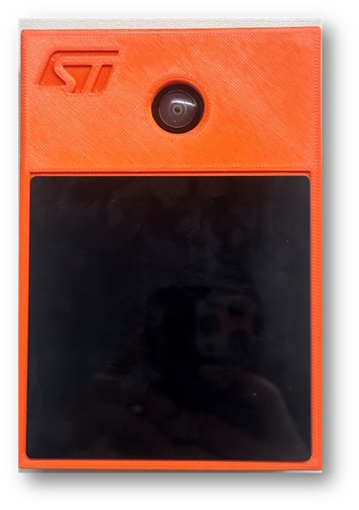

# AI Assistant reference application

[](https://htmlpreview.github.io/?https://github.com/stm32-hotspot/STM32N6-AI-Assistant-People-Detection/blob/main/Release_Notes.html)
[](https://htmlpreview.github.io/?https://github.com/stm32-hotspot/STM32N6-AI-Assistant-People-Detection/blob/main/LICENSE.html)
[](https://ols.st.com/s/)

## Overview

Computer Vision application to enable the deployment of object detection models on AI Assistant board. It's based on the official release of n6-ai-people-detection-v1.0.0 application package for STM32N6570-DK board.

This application is prebuilt with a people detection model "TinyYOLOv2".

This top readme gives an overview of the app. Additional documentation is available in the [Doc](./Doc/) folder.

## Doc Folder Content

- [Application Overview](Doc/Application-Overview.md)
- [Boot Overview](Doc/Boot-Overview.md)
- [Deploy Your TFLite Model](Doc/Deploy-your-tflite-Model.md)
- [Camera Build Options](Doc/Build-Options.md)

## Features Demonstrated in This Example

- Multi-threaded application flow (Azure RTOS ThreadX)
- NPU accelerated quantized AI model inference
- Dual DCMIPP pipes
- DCMIPP crop, decimation, downscale
- LTDC dual-layer implementation
- DCMIPP ISP usage
- Dev mode
- Boot from External Flash

## Hardware Support

- AI Assistant Kit

- 3 Cameras are supported:
  - MB1854B IMX335
  - STEVAL-55G1MBI VD55G1 Camera module (Default Camera provided with the MB1939 STM32N6570-DK board)
  - STEVAL-66GYMAI VD66GY Camera module



AI Assistant kit with VD55G1 Camera.

## Tools Version

- IAR Embedded Workbench for Arm (**EWARM 9.40.1**) + N6 patch ([**EWARMv9_STM32N6xx_V1.0.0**](STM32Cube_FW_N6/Utilities/PC_Software/EWARMv9_STM32N6xx_V1.0.0.zip))
- STM32CubeIDE (**STM32CubeIDE 1.18.0**)
- STM32CubeProgrammer (**v2.18.0**)
- [STEdgeAI](https://www.st.com/en/development-tools/stedgeai-core.html) (**v2.1.0**)

## Boot Modes

The STM32N6 does not have any internal flash. To retain your firmware after a reboot, you must program it in the external flash.
Alternatively, you can load your firmware directly from SRAM (dev mode). However, in dev mode, if you turn off the board, your program will be lost.

__Boot modes:__
- Dev mode: load firmware from debug session in RAM (boot switch to the right)
- Boot from flash: Program firmware in external flash (boot switch to the left)

## Quickstart Using Prebuilt Binaries

### Flash Prebuilt Binaries

Three binaries must be programmed into the board's external flash using the following procedure:

  1. Switch the BOOT switch to the up position.
  2. Program `Binary/ai_assistant_fsbl.hex` (To be done once) (First stage boot loader).
  3. Program `Binary/network_data.hex` (parameters of the networks; To be changed only when the network is changed).
  4. Program `Binary/AI_Assistant_Ref_Project.hex` (firmware application).
  5. Switch the BOOT switch to the down position.
  6. Perform a power down/up sequence.

### How to Program Hex Files Using STM32CubeProgrammer UI

See [How to Program Hex Files STM32CubeProgrammer](Doc/Program-Hex-Files-STM32CubeProgrammer.md).

### How to Program Hex Files Using Command Line

Make sure to have the STM32CubeProgrammer bin folder added to your path.

```bash
export DKEL="<STM32CubeProgrammer_N6 Install Folder>/bin/ExternalLoader/MX66UW1G45G_STM32N6570-DK.stldr"

# First Stage Boot Loader
STM32_Programmer_CLI -c port=SWD mode=HOTPLUG -el $DKEL -hardRst -w Binary/ai_fsbl.hex

# Network Parameters and Biases
STM32_Programmer_CLI -c port=SWD mode=HOTPLUG -el $DKEL -hardRst -w Binary/network_data.hex

# Application Firmware
STM32_Programmer_CLI -c port=SWD mode=HOTPLUG -el $DKEL -hardRst -w Binary/x-cube-n6-ai-people-detection.hex
```

## Quickstart Using Source Code

Before building and running the application, you have to program `network_data.hex` (model weights and biases).

This step only has to be done once unless you change the AI model.
See [Quickstart Using Prebuilt Binaries](#quickstart-using-prebuilt-binaries) for details.

More information about boot modes is available at [Boot Overview](Doc/Boot-Overview.md).

### Application Build and Run - Dev Mode

__Make sure to have the switch to the right side.__

#### STM32CubeIDE

Double click on `STM32CubeIDE/.project` to open the project in STM32CubeIDE. Build and run with the build and run buttons.

#### IAR EWARM

Double click on `EWARM/Project.eww` to open the project in IAR IDE. Build and run with the build and run buttons.

#### Makefile

Before running the commands below, be sure to have the commands in your PATH.

1. Build the project using the provided `Makefile`:

```bash
make -j8
```

2. Open a GDB server connected to the STM32 target:

```bash
ST-LINK_gdbserver -p 61234 -l 1 -d -s -cp <path-to-stm32cubeprogramer-bin-dir> -m 1 -g
```

3. In a separate terminal session, launch a GDB session to load the firmware image into the device memory:

```bash
$ arm-none-eabi-gdb build/Project.elf
(gdb) target remote :61234
(gdb) monitor reset
(gdb) load
(gdb) continue
```

### Application Build and Run - Boot from Flash

__Make sure to have the switch on the right side.__

#### STM32CubeIDE

Double click on `STM32CubeIDE/.project` to open project in STM32CubeIDE. Build with build button.

#### IAR EWARM

Double click on `EWARM/Project.eww` to open project in IAR IDE. Build with build button.

#### Makefile

Before running the commands below, be sure to have them in your PATH.

1. Build project using the provided `Makefile`:

```bash
make -j8
```

Once your app is built with Makefile, STM32CubeIDE, or EWARM, you can add a signature to the bin file:
```bash
STM32_SigningTool_CLI -bin build/Project.bin -nk -t ssbl -hv 2.3 -o build/Project_sign.bin
```

You can program the signed bin file at the address `0x70100000`.

```bash
export DKEL="<STM32CubeProgrammer_N6 Install Folder>/bin/ExternalLoader/MX66UW1G45G_STM32N6570-DK.stldr"

# Adapt build path to your IDE
STM32_Programmer_CLI -c port=SWD mode=HOTPLUG -el $DKEL -hardRst -w build/Project_sign.bin 0x70100000
```

Note: Only the App binary needs to be programmed if the FSBL and network_data.hex were previously programmed.

## Known Issues and Limitations

- (NN_WIDTH * NN_BPP) must be a multiple of 16.
- (LCD_BG_WIDTH * 2) must be a multiple of 16.
